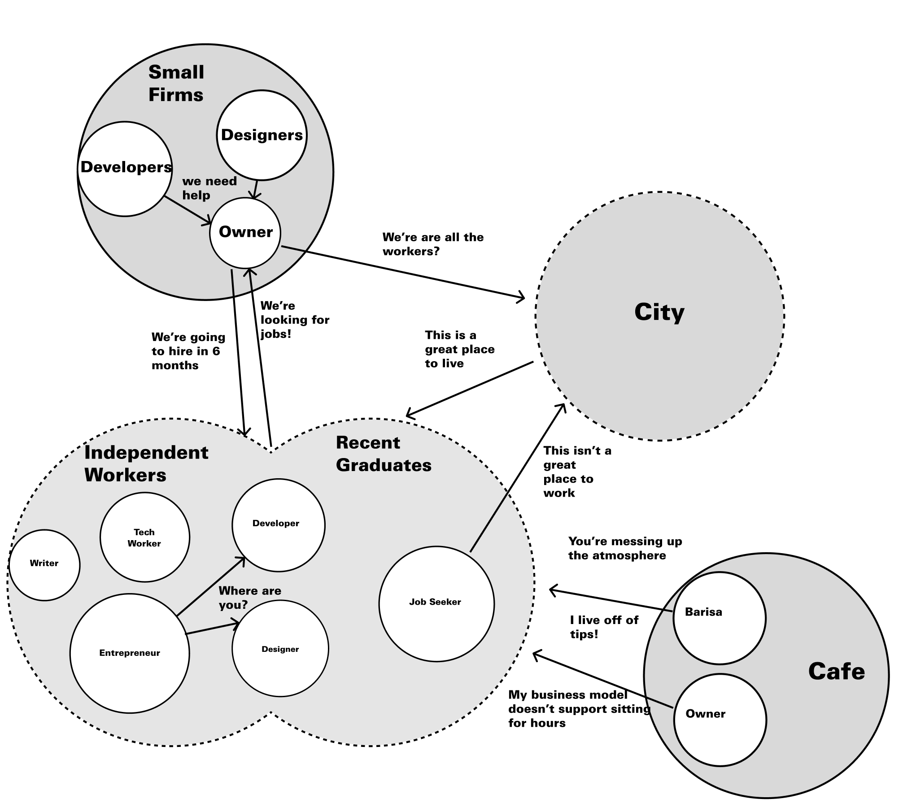
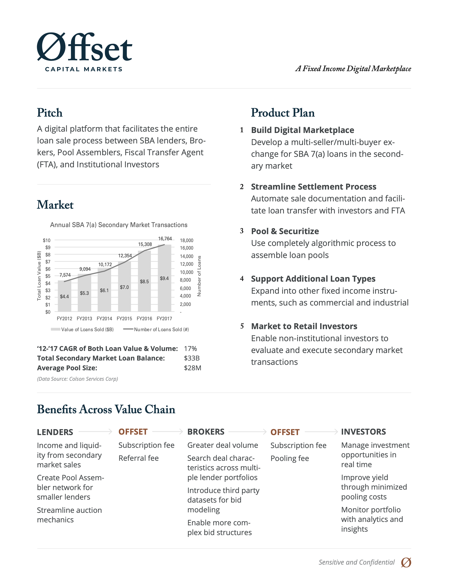

#+title: Portfolio



* Introduction

Most of the work I do isn't fully visual, [[][it's organizational, cultural, and entrepreneurial]]. So instead of a bunch of whizzbang screens, here are a set of case studies--mostly text based stories taking readers through the processes of the projects. Almost no projects in the 15 years of my career have had clean double-diamond or four step approaches. Mostly they flowed with the demands of the larger organizations. Stop here for a presentation, double-down on research, or build now, research later.
* [[][UPMC]]







This was the project that got me excited about Service Design. Wayfinding, Service Blueprints, and a clear set of project phases. In addition to standard methods, I developed a remapping technique to understand the values of individuals and community ethos: prompted with a set of four image cards per question, users were asked “if healthcare in the future were” one of the four juicers, one of the four magazines, one of the four vacation spots, one of the four cars, “which one would it be and why?” The choices they made were irrelevant; what mattered was their justifications: “I like the green juicer because it’s personal. It’s one-at-a-time. With the industrial juicer, I would feel like just another orange.”

* [[][Catapult Coworking Community]]



Catapult PGH was the first coworking space in Pittsburgh--before anyone even knew what coworking meant. It was a product of co-design and a lot of research to understand the needs of independent workers, the City of Pittsburgh, and local small firms in need of talent. This was primarily a Service Design project turned thriving donation-based community space.


A cultural model representing the demands of stakeholders in the ecosystem.


* [[][LegalSifter]]



This is an extremely condensed version of how my startup went from back-of-napkin to research to launch to pivot. It was a wild ride where my team made something awesome, launched it to what I thought was a great success, and immediately had to pivot to a B2B model with a whole new product to save the company.

* [[][Pitch Fest]]



I was asked to developing a venture pipeline of fintech ideas to be grown as spin-offs of the bank. I did everything from identifying ideas that had merit, creating plans to build technology, to developing [[][revenue models]] and go to market strategies.

The problem wasn't the formal processes and procedures. There was an amazing COO in place that kept everything running smoothly. The problem was the lack of a culture of excitement and creation needed to build an innovative culture. [[][Pitch Fest]] was the solution to that problem. By turning routine meetings and product decks into fun and exciting corporate concept pitches, the product pipeline flourished and the very first businesses were launched into the wild.

* [[][Offset Capital Markets]]

This was a very corporate finance-y project that was more about opportunity finding and making a case for its existence in the bank than a traditional design project. Instead of project decks, we had a constantly updating /one pager/ to circulate around the bank.

* [[][LikeNow]]



LikeNow is a two-sided marketplace for the long tail of verticals that will never have enough use to warrant individual apps. Think Craigslist for the on-demand industry. 
posts/service-blueprinting-to-align-an-organization/

* Portfolio

** Introduction
As an experienced Interaction Designer, my work transcends visual aesthetics to encompass organizational transformation, cultural development, and entrepreneurial innovation. Over my 15-year career, I have led diverse projects that adapt to organizational demands, employing flexible methodologies to drive impactful outcomes. Below are selected case studies illustrating my strategic design leadership.

** UPMC: Pioneering Service Design in Healthcare
*Role*: Lead Service Designer

*Overview*: At UPMC, I spearheaded a comprehensive service design project focusing on wayfinding and service blueprints. I developed an innovative remapping technique to uncover individual and community values, facilitating a user-centered approach to healthcare service delivery.

*Key Contributions*:
- Conducted in-depth user research using image-based prompts to elicit values and preferences.  
- Created detailed service blueprints to map patient journeys and identify improvement areas.  
- Collaborated with cross-functional teams to implement design solutions enhancing patient experience.  

** Catapult Coworking Community: Building Pittsburgh’s First Coworking Space
*Role*: Co-Founder and Service Designer

*Overview*: I co-founded Catapult PGH, Pittsburgh’s inaugural coworking space, through a co-design process informed by extensive research into the needs of independent workers and local businesses. This initiative evolved into a thriving, donation-based community hub.

*Key Contributions*:
- Led user research to identify the requirements of freelancers and small firms.  
- Designed the space and service offerings to foster collaboration and community engagement.  
- Established sustainable operational models to support ongoing community growth.  

** LegalSifter: Navigating Startup Evolution from B2C to B2B
*Role*: Co-Founder and Chief Design Officer

*Overview*: At LegalSifter, I guided the company from concept through launch, leading a pivotal pivot from a B2C model to a B2B SaaS product. This transition was critical in aligning the product with market needs and ensuring business viability.

*Key Contributions*:
- Directed user research to validate product-market fit and inform strategic direction.  
- Oversaw the design and development of the product interface, emphasizing usability and client value.  
- Collaborated with stakeholders to redefine business models and go-to-market strategies.  

** Pitch Fest: Cultivating a Culture of Innovation in Financial Services
*Role*: Innovation Strategist

*Overview*: Tasked with developing a venture pipeline for fintech innovations within a traditional bank, I identified viable ideas, formulated development plans, and crafted revenue models. To foster an innovative culture, I introduced "Pitch Fest," transforming routine meetings into dynamic pitch sessions, leading to the successful launch of new business ventures.

*Key Contributions*:
- Assessed and prioritized fintech opportunities aligned with organizational goals.  
- Facilitated workshops to encourage creative thinking and cross-departmental collaboration.  
- Implemented processes to support the incubation and scaling of new ventures.  

** Offset Capital Markets: Identifying Opportunities in SBA Loans
*Role*: Strategic Designer

*Overview*: Leading a team to explore financial opportunities related to Small Business Loans, I conducted comprehensive research to uncover innovative product possibilities. This project emphasized opportunity identification and strategic alignment within the bank.

*Key Contributions*:
- Conducted stakeholder interviews to map the lifecycle of SBA loans and identify pain points.  
- Developed strategic recommendations for new financial products tailored to small business needs.  
- Created concise communication materials to advocate for proposed initiatives within the bank.  

** LikeNow: Creating a Two-Sided Marketplace for Niche Services
*Role*: Product Designer

*Overview*: LikeNow is a two-sided marketplace catering to niche verticals lacking dedicated applications, akin to a specialized Craigslist for the on-demand industry. I led the design of the platform, focusing on user engagement and marketplace dynamics.

*Key Contributions*:
- Designed intuitive interfaces to facilitate user interactions and transactions.  
- Developed strategies to balance supply and demand within the marketplace.  
- Implemented feedback loops to continuously refine the user experience.  

