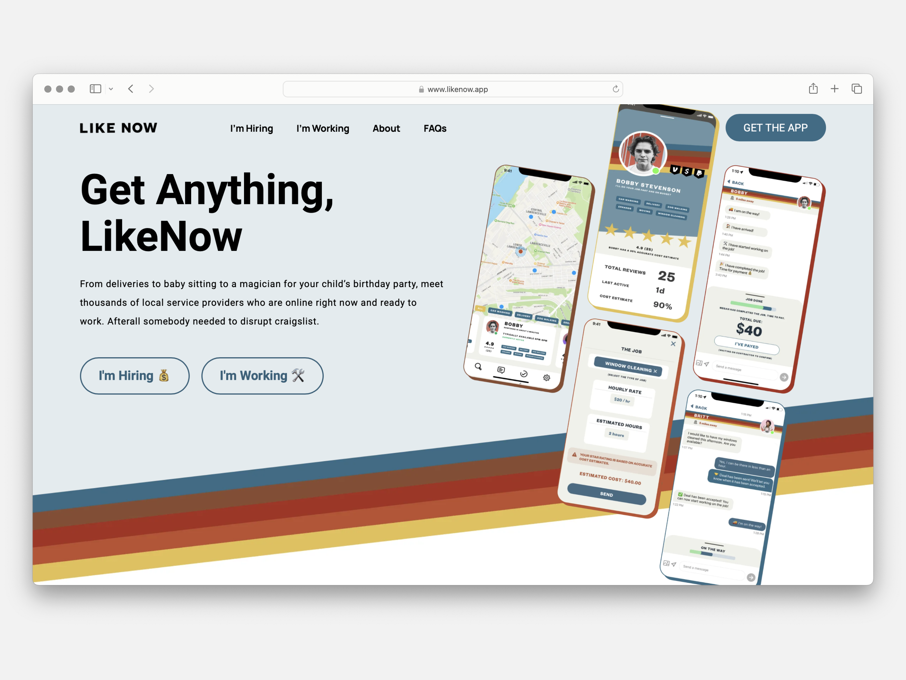
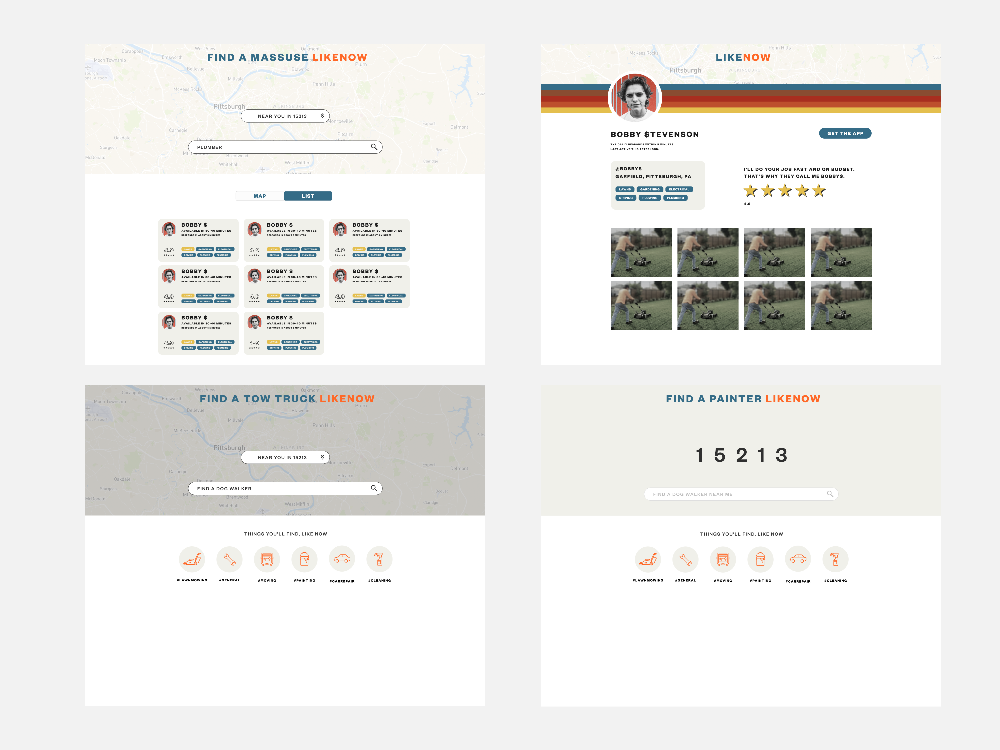
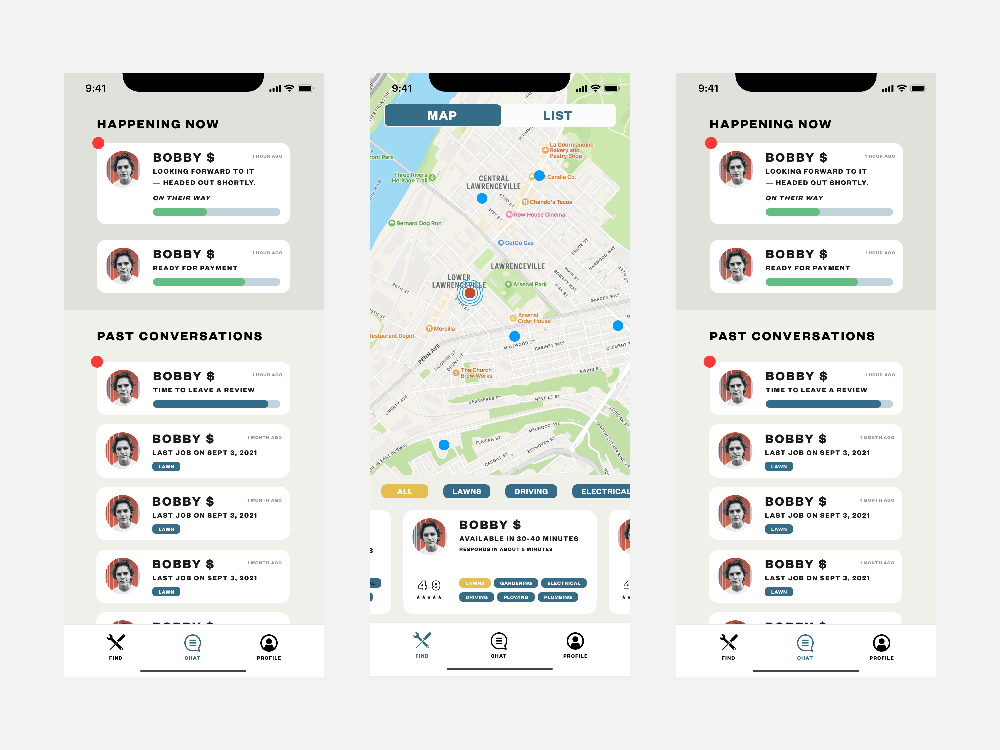
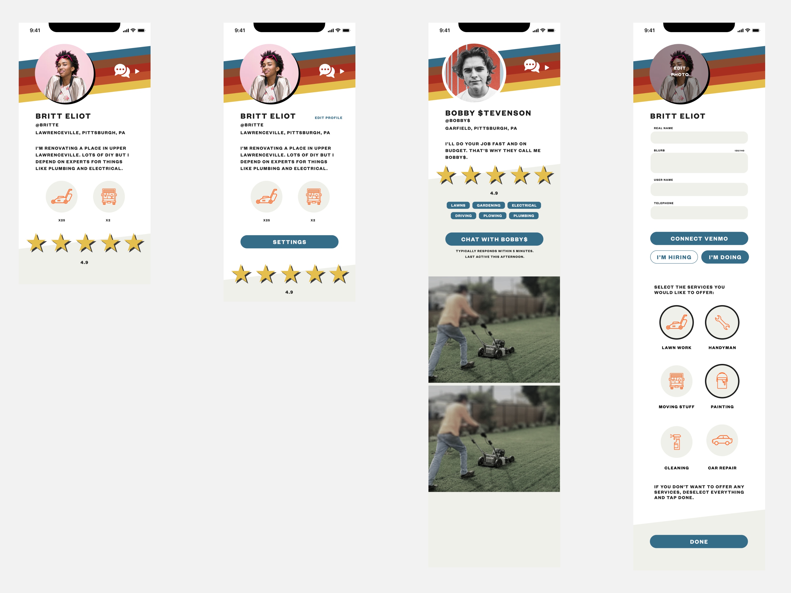
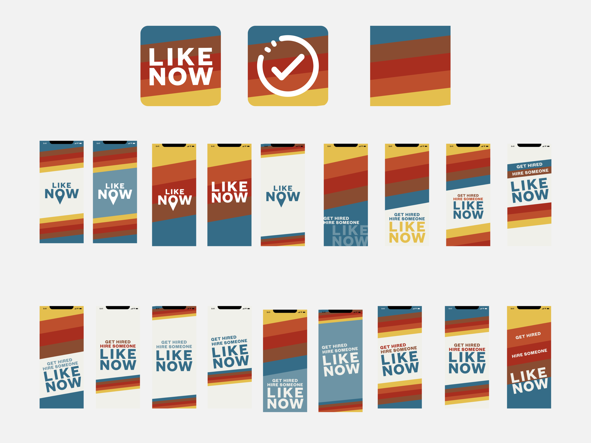
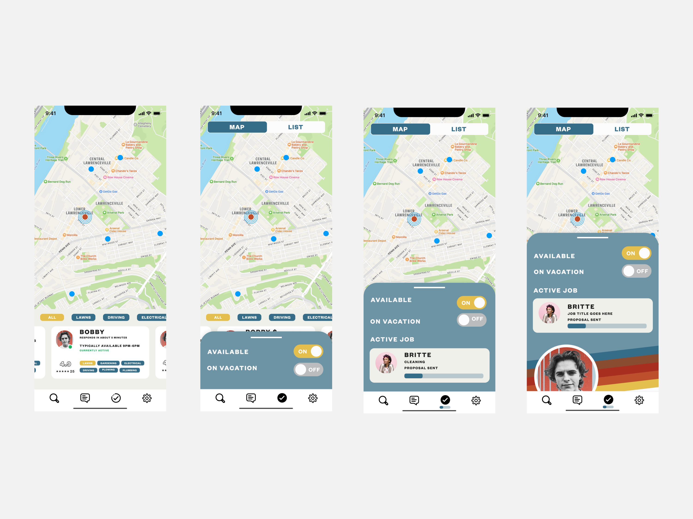

#+date: 2021-02-02
#+categories: Projects
#+categories: Mobile
#+categories: Marketplace
#+title: Designing an App with Friends

*One conversation turned into a company*

LikeNow started from a single conversation. Joey had the realization that startup "dogfooding" culture had left out lower-income citizens from the majority of startup ideas. I was working on an on-demand company to buy back used electronics with a demographic mainly in lower-income areas. After that conversation, Joey and I decided to join forces, both expanding the concept from just buying back used electronics, to covering the entire spectrum of the /Craigslist Economy/.

 **Roles:** Founder, Designer.   
**Collaborators:** Joey Rahimi, Mike Darweesh, Megan Earfly


* Discovery
Lower-income citizens are constantly excluded from the majority of the job market. This doesn't just cover traditional 9-5 jobs, but expands all the way to on-demand apps such as working for Uber or Instacart. Several factors cause this phenomenon including how the legal system constantly and disproportionately charges and convicts poor people with crimes. Additionally, most of the on-demand economy requires background checks and vehicle minimums meaning to even drive for Uber, a person needs to have a car worth more than some people's yearly salary. Adding insult to injury, once these jobs are secured, the salaries are as low as a few dollars an hour creating a new loophole evading the minimum wage in this country.

** Bill
We met Bill because he was looking for a developer to build a bespoke app to help him sell candy in Wilkinsburg PA. William would take his mini van to Costco, fill it up with candy, and then drive around the neighborhood as kids flagged him down for sales. It was such a great business William mentioned he was purchasing a new Sprinter Van. It turns out, William averaged over 60,000 dollars a year in profits. William also talked about all the other small off-the-books cash based businesses in a town of only 13,000 people.

*** Approach
- /To making money/: Stay hungry. Keep moving. Be where the customers are.

*** Views

*** Struggles

*** Opportunities

* Current State
Lower-income citizens are constantly excluded from the majority of the job market. This doesn't just cover traditional 9-5 jobs, but expands all the way to on-demand apps such as Uber and Instacart. Several factors cause this phenomenon including how the legal system constantly and disproportionately charges and convicts poor people with crimes. Additionally, most of the on-demand economy requires background checks and vehicle minimums meaning to even drive for Uber, a person needs to have a car worth more than some people's yearly salary. Adding insult to injury, once these jobs are secured, the salaries are as low as a few dollars an hour creating a new loophole evading the minimum wage in this country.
* Ideal State
The concept is simple. Build an alternative to the Uber's and Doordash's that 1 respect the diversity of skills of an individual, and 2 don't charge 25-50 percent of earnings. The former strategy is to promote the "handyman" aspect of most people in lower-income tiers. In contrast to the hyperspeciality of high paid jobs (iOS micro-animations designer as an example), most lower paid jobs, and so lower paid citizens, have a wider array of skills that demand lower rates from the job market. Instead of pegging people into a single vertical causing many to use multiple apps each day to earn a living, create a place where the worker is elevated and encouraged to express their multiplicity of value they can contribute to the world.

Secondly, instead of destroying a chance for an honest living with steep fees that are most of the time even higher than Federal Income Taxes to support salaries of thousands of tech workers, stay lean, keep the team small and keep the founding team squarely in the middle class and not chasing massive exits. 

 

-------------

* 1. Discovery: Identifying the Problem
** Initial Insight
LikeNow began with a simple conversation. Joey Rahimi realized that startup culture, particularly in the realm of "dogfooding," often overlooks lower-income citizens. Meanwhile, I was developing an on-demand service to buy back used electronics, with a customer base primarily from lower-income areas. Our shared observations led us to explore how startups could better serve this often-ignored demographic.

** The Problem
Lower-income citizens are disproportionately excluded from both traditional 9-to-5 jobs and gig economy platforms like Uber and Instacart. This exclusion stems from multiple systemic issues:
- **Barriers to Entry:** Gig platforms often require background checks, expensive vehicles, or other prerequisites that are unattainable for many.
- **Exploitative Models:** High platform fees (sometimes exceeding federal tax rates) and low wages reduce the already limited income of gig workers.
- **Limited Avenues:** Current platforms force workers into hyperspecialized roles, ignoring the broader skillsets many individuals possess.

** Persona Development: Understanding the People We Serve
To ensure LikeNow would truly meet the needs of its intended users, I conducted research and created user personas using a rigorous, qualitative process. This helped us move beyond stereotypes and design a platform grounded in real user needs.

*Step 1: Ask Rich Questions, Not Dumb Questions*

I conducted in-depth interviews guided by **rich questions** designed to understand participants’ broader lives, not just their interaction with potential products. This approach uncovered deep insights into their values, motivations, and challenges.

/Example Questions:/
- What does a good day look like for you?
- What are you most proud of in your work or life?
- How do you typically find opportunities to earn money?
- What barriers make it difficult for you to achieve your goals?

*Step 2: Write a Codebook*

I analyzed interview transcripts and observation notes by creating a **codebook** to capture recurring themes and patterns. Each code included a definition, examples, and counterexamples to ensure clarity.

/Example Code:/
- *Code:* "Vehicle as a Barrier"
  - *Definition:* Challenges participants face due to vehicle requirements (e.g., cost of ownership, maintenance, lack of access).
  - *Example:* "I’d drive for Uber, but my car doesn’t meet their standards, and I can’t afford to upgrade."
  - *Non-Example:* Complaints about traffic delays.

*** Step 3: Code the Data
Using tools like Notion and Google Sheets, I coded the transcripts line by line, tagging each insight with a relevant theme. This process revealed patterns such as significant overlaps between vehicle-related barriers and reliance on informal gig networks.

*** Step 4: Map the Data
Through affinity mapping, I clustered similar responses and insights to uncover patterns. For example, participants who valued their versatility (e.g., being a handyman, babysitter, or painter) frequently expressed frustration with platforms that restricted them to a single niche.

*** Step 5: Form the Personas
I synthesized the data into three actionable personas that focused on behaviors, motivations, and barriers rather than demographic shortcuts.

- *Marcus, The Hustler*
  - *Behaviors:* Juggles multiple apps daily; constantly searching for work.
  - *Motivations:* Wants to save for a reliable car to expand job opportunities.
  - *Challenges:* Feels exploited by platform fees; struggles with inconsistent income.

- *Linda, The Generalist*
  - *Behaviors:* Relies on word-of-mouth and local networks for jobs.
  - *Motivations:* Seeks reliable work to support her family.
  - *Challenges:* Finds it hard to showcase her versatility on traditional gig platforms.

- *Kevin, The Fresh Start*
  - *Behaviors:* Avoids mainstream platforms due to background checks.
  - *Motivations:* Desires stability and the chance to rebuild trust in his community.
  - *Challenges:* Feels excluded from opportunities despite having skills and a strong work ethic.

---

* 2. Definition: A Vision for Change
** The Goal
To build an inclusive platform that provides fair opportunities for workers in lower-income demographics. LikeNow’s mission is twofold:
1. *Elevate Worker Skills:* Create a platform where individuals can showcase and monetize their diverse skill sets without being restricted to hyperspecialized roles.
2. *Promote Fair Earnings:* Keep platform fees low and build a lean business model that prioritizes worker income over massive exits or excessive corporate overhead.
   
** Key Insights Shaping the Vision
- Lower-income workers often excel as "handymen" or "generalists," with valuable, varied skills that don’t fit neatly into the narrow verticals of most gig apps.
- High platform fees destroy potential earnings for workers, perpetuating the poverty cycle.

---

* 3. Design: Crafting the Solution
** Design Principles
The design phase focused on creating a platform that was:
- **Accessible:** Simplified onboarding with minimal barriers, ensuring inclusivity for workers who might otherwise be excluded.
- **Empowering:** A user experience that highlights the multifaceted skills of each individual, allowing them to market themselves effectively.
- **Transparent:** A clear and fair fee structure that avoids the exploitative practices of other gig platforms.

** Key Features
1. **Skill Showcasing:** LikeNow allows users to list and market their wide range of skills.
2. **Fair Fees:** Fees are capped at a fraction of the industry standard, ensuring workers retain the majority of their earnings.
3. **Streamlined User Flow:** Workers can easily find gigs across multiple categories, simplifying their workday by consolidating opportunities in one place.

** Collaborations
I worked alongside Joey Rahimi, Mike Darweesh, and Megan Earfly to conceptualize and prototype the platform. As the designer, I translated our vision into a cohesive, user-friendly experience that reflected our principles of fairness and inclusion.

---

* 4. Delivery: Building and Launching the Platform
** Current State
We’ve developed initial prototypes of the platform, including UI designs and a lean backend structure to keep operational costs low. The app’s early version focuses on a small, testable subset of the gig economy to validate our ideas and ensure worker satisfaction.

** Outcomes
- **Prototype Development:** Early UI/UX designs illustrate how users can seamlessly navigate the platform, list their skills, and connect with job opportunities.
- **Community Feedback:** Initial feedback from focus groups of lower-income workers has been instrumental in refining the platform’s features and usability.
- **Scalability Plan:** Our lean approach ensures LikeNow can scale without compromising its core mission of worker empowerment and fair pay.

** Next Steps
1. **Pilot Launch:** Test the platform with a small group of workers and clients to collect further feedback.
2. **Iterate on Design:** Refine the user experience based on pilot data and feedback.
3. **Expand Scope:** Gradually roll out the platform to include more job categories and regions while maintaining the core values of inclusivity and fairness.
