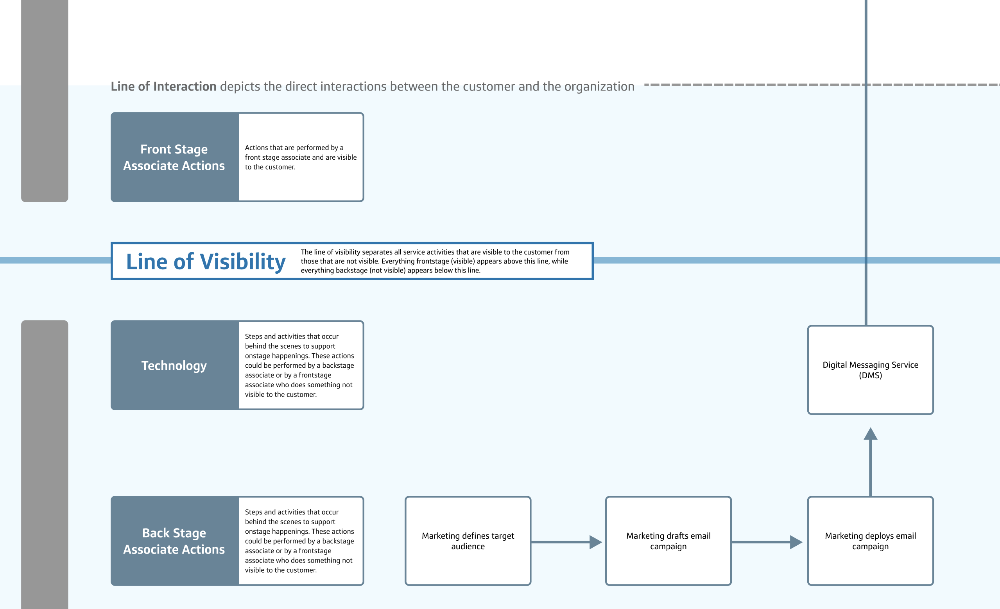
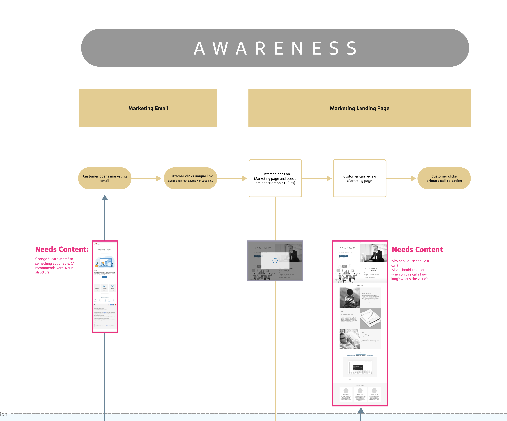

#+date: 2021-12-20
#+categories: Projects #project
#+title: Service Blueprinting for Alignment

Capital One's wealth management team was struggling to launch. There wasn't an overarching understanding of all the moving parts between calendaring with Wealth Managers, backend infrastructure, and design requirements.

I worked with my design team to create a single diagram outlining all the steps of the service experience, while tying in the underlying components needed to actually build the thing.

The diagram illustrated a clear line between what the user would experience and all the underlying parts needed to make that experience a reality:

While also coordinating work to be done across design, development, wealth manangement, and content:

In the end, we had a living document that not only had the current state of tasks to be done, but also gave all the teams a central source of truth and reference point:



* Aligning an Organization Through Service Blueprinting

** Overview
Service blueprinting isn’t just a design tool; it’s a game-changer for organizational alignment. 
As a designer, I’ve leveraged this method to bring clarity to complex systems, bridge communication 
gaps, and create actionable insights that drive user-centered innovation. In one of my most impactful 
projects, I used service blueprinting to transform a fragmented organization into a cohesive, 
collaborative powerhouse—ultimately delivering a better user experience and measurable business results.

** The Challenge: Breaking Down Silos
In large organizations, it’s not uncommon to find teams working in silos, each focusing on their own 
priorities with limited visibility into the bigger picture. This misalignment leads to:
- Inconsistent user experiences due to disjointed touchpoints.
- Inefficient processes caused by unclear ownership and redundant efforts.
- Frustrated teams who struggle to collaborate effectively across functions.

I was tasked with addressing these issues, aligning teams around a shared understanding of the user 
journey, and creating a foundation for sustainable improvements.

** My Role
As the design lead for this project, I:
- Introduced *service blueprinting* as a tool to map the entire user journey across front-stage and back-stage processes.
- Facilitated *collaborative workshops* with stakeholders from multiple departments, ensuring every voice was heard and represented.
- Synthesized insights into an actionable roadmap that prioritized high-impact improvements.
- Advocated for *user-centered decision-making*, guiding leadership to align goals with user needs.

** The Power of Service Design Inside a Company
Service design isn’t just about improving individual touchpoints—it’s about creating alignment and 
empowering organizations to work as a unified system. By adopting service design principles, 
companies can:
- Identify and address inefficiencies in workflows, ensuring smoother processes across teams.
- Align cross-functional departments around shared goals, improving collaboration and decision-making.
- Create more meaningful and consistent user experiences by connecting back-stage processes to front-stage interactions.
- Foster a culture of innovation and adaptability, enabling the organization to scale and evolve effectively.

In this project, service blueprinting became a catalyst for organizational change. It helped teams see 
how their individual roles contributed to the overall user experience, breaking down silos and 
building a sense of collective ownership.

** The Power of Service Blueprinting
*** Creating a Holistic View
Using the service blueprint, I mapped:
- *User actions*: What the user does, feels, and experiences at every step.
- *Front-stage touchpoints*: The visible elements, including customer-facing tools, interactions, and interfaces.
- *Back-stage processes*: The behind-the-scenes workflows and systems that support user interactions.
- *Supporting systems*: The technology and infrastructure enabling the entire experience.

This visualization uncovered inefficiencies, redundancies, and gaps in both the user journey and 
internal processes. It also provided a shared framework that helped teams understand their roles in 
delivering a seamless user experience.

*** Driving Cross-Functional Collaboration
To break down silos, I facilitated workshops that brought together stakeholders from design, 
engineering, product, and operations teams. During these sessions:
- We co-created the service blueprint, which ensured *buy-in and ownership* from all participants.
- Teams identified pain points and opportunities from their unique perspectives, fostering mutual understanding.
- I guided the group toward *prioritizing actionable solutions* that aligned with both user needs and business goals.

By the end of the process, teams were no longer thinking in isolation—they were aligned around a 
shared vision of the user journey.

*** Prioritizing High-Impact Improvements
Service blueprinting revealed critical areas for improvement, including:
- *Workflow inefficiencies*: Bottlenecks in back-stage processes that delayed front-stage interactions.
- *Inconsistent user touchpoints*: Gaps in communication that created friction for users.
- *Underutilized technology*: Tools that were either redundant or misaligned with user needs.

I translated these findings into a prioritized roadmap that:
- Addressed the most urgent user pain points first.
- Delivered *quick wins* to build momentum and confidence among stakeholders.
- Laid the groundwork for long-term improvements.

** Results and Impact
The service blueprinting process delivered tangible outcomes:
1. *Streamlined Workflows*: Internal processes became more efficient, reducing time-to-resolution by *20%*.
2. *Improved Collaboration*: Teams reported a *30% increase in cross-departmental communication* and alignment.
3. *Enhanced User Experience*: Key friction points were eliminated, leading to a *15% boost in user satisfaction scores*.
4. *Empowered Teams*: Stakeholders gained a shared understanding of their impact on the user journey, enabling ongoing improvements.

** Reflection: Why This Matters as a Designer
This project demonstrated the power of *service design* in solving complex organizational challenges. 
By focusing on aligning people, processes, and systems, I was able to lead a redesign that not only 
improved usability but also delivered measurable business outcomes.

The experience reinforced my ability to:
- Apply *systems thinking* to untangle complexity and create clarity.
- Lead *collaborative processes* that empowered teams to work together more effectively.
- Demonstrate the strategic value of design by delivering measurable business and user outcomes.

As a designer, my role is not just to design better products but to design better organizations—ones 
that put the user at the center of every decision. Service blueprinting is one of the many tools I use to make that happen.
